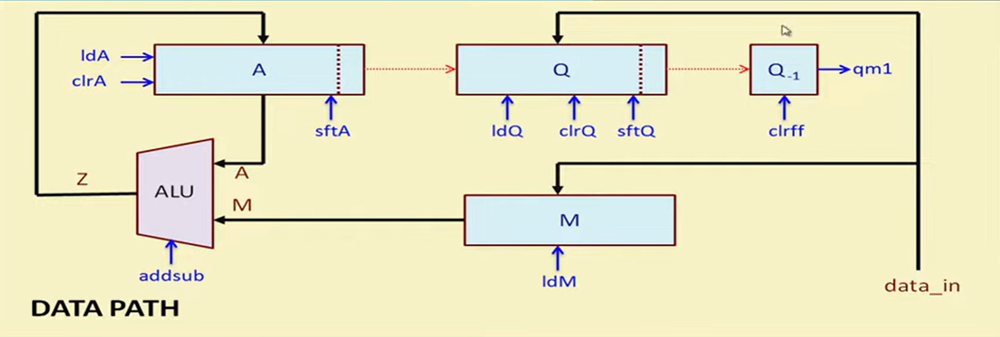

# Booth Multiplier using Verilog HDL

This project presents a modular RTL implementation of **Booth's Multiplication Algorithm** using **Verilog HDL**. Booth's algorithm is an efficient technique for performing signed binary multiplication by reducing the number of addition and subtraction operations, making it well-suited for high-performance digital systems.

The design adopts a **datapath–control path architecture**, where an **FSM-based controller** coordinates arithmetic operations, register shifting, and iteration control throughout the multiplication process. The implementation has been functionally verified using **Xilinx Vivado**, with simulation waveforms and console outputs confirming the correctness of the design.

Booth's Multiplication Algorithm is an efficient method for performing **signed binary multiplication** using two's complement representation. Instead of adding the multiplicand for every `1` in the multiplier, the algorithm examines two adjacent bits (`Q₀` and `Q₋₁`) to determine the required operation. This approach minimizes the number of addition and subtraction operations, making it suitable for hardware implementations.

## Booth's Multiplication Algorithm

Booth's Multiplication Algorithm is an efficient method for performing **signed binary multiplication** using two's complement representation. Instead of adding the multiplicand for every `1` in the multiplier, the algorithm examines two adjacent bits (`Q₀` and `Q₋₁`) to determine the required operation. This approach minimizes the number of addition and subtraction operations, making it suitable for hardware implementations.

### Working Principle

1. Initialize the **Accumulator (A)** to zero and load the **Multiplicand (M)** and **Multiplier (Q)** into their respective registers.
2. Set the extra bit **Q₋₁** to `0`.
3. Examine the pair **(Q₀, Q₋₁)**:
   - **00** or **11** → No arithmetic operation.
   - **01** → Add the multiplicand to the accumulator.
   - **10** → Subtract the multiplicand from the accumulator.
4. Perform an **arithmetic right shift** on the combined register `(A, Q, Q₋₁)`.
5. Repeat the above steps for **n** clock cycles, where **n** is the number of bits.
6. After the final iteration, concatenate **A** and **Q** to obtain the signed multiplication result.

  

<b>Fig. 1.</b> Flowchart of Booth's Multiplication Algorithm.

## Architecture

The Booth Multiplier is designed using a **modular datapath–control path architecture**, which separates computational operations from control logic. This design methodology improves modularity, simplifies debugging, and enhances scalability for larger hardware implementations.

The **datapath** is responsible for executing arithmetic and shift operations, while the **control path** generates the control signals required to coordinate the sequential execution of Booth's multiplication algorithm. Communication between these two units ensures the correct execution of each multiplication cycle until the final product is obtained.

  

<b>Fig. 2.</b> Overall architecture showing the interaction between the datapath and control path.

### Datapath

The datapath is the computational unit of the Booth Multiplier responsible for performing all arithmetic and data movement operations required during the multiplication process. It consists of the **Accumulator (A)**, **Multiplier Register (Q)**, **Multiplicand Register (M)**, **Arithmetic Logic Unit (ALU)**, **Shift Register**, **Counter**, and **D Flip-Flop (Q₋₁)**. These components work together to execute addition, subtraction, arithmetic right shifting, and intermediate result storage as directed by the control path.

The datapath receives control signals from the FSM-based controller and performs the corresponding operations at each clock cycle. After completing all iterations of Booth's algorithm, the contents of the accumulator and multiplier registers are combined to produce the final signed multiplication result.

  

<b>Fig. 3.</b> Datapath architecture of the Booth Multiplier.

### Control Path

The control path is responsible for coordinating the sequential execution of Booth's Multiplication Algorithm. It generates the control signals required to manage the operations performed by the datapath, including register loading, arithmetic operations, arithmetic right shifting, and iteration control.

An FSM-based controller continuously monitors the current state of the multiplier and the iteration count to determine the appropriate control action. By synchronizing the datapath components at every clock cycle, the control path ensures that Booth's algorithm is executed correctly until the multiplication process is complete.

  

<b>Fig. 4.</b> Control path architecture of the Booth Multiplier.

## Finite State Machine (FSM)

The Booth Multiplier employs a **Finite State Machine (FSM)** to control the sequence of operations during multiplication. Each state corresponds to a specific stage of the algorithm, such as initialization, operand evaluation, arithmetic operation, arithmetic right shifting, counter update, and completion.

Based on the values of the least significant multiplier bit (**Q₀**) and the previous bit (**Q₋₁**), the FSM determines whether the datapath should perform an addition, subtraction, or no arithmetic operation before executing an arithmetic right shift. The process repeats until all iterations are completed, after which the FSM transitions to the final state and asserts the completion signal.

  

<b>Fig. 5.</b> Finite State Machine (FSM) controlling the Booth multiplication process.

## Simulation Results

The functionality of the Booth Multiplier was verified through simulation using **Xilinx Vivado**. A comprehensive Verilog testbench was developed to validate the implementation for different signed multiplication cases. The simulation confirms the correct execution of Booth's algorithm, including arithmetic operations, arithmetic right shifting, and generation of the final product.

### Simulation Waveform

The waveform illustrates the sequential operation of the Booth Multiplier during the multiplication process. It shows the clock-driven execution of the algorithm, including control signal generation, register updates, arithmetic operations, and the final multiplication result.

  

<b>Fig. 6.</b> Simulation waveform of the Booth Multiplier.

### Console Output

The console output displays the multiplication results generated during simulation. The obtained products match the expected values, confirming the functional correctness of the RTL implementation.

  

<b>Fig. 7.</b> Console output verifying the multiplication results.

## Tools & Technologies

- **Hardware Description Language:** Verilog HDL
- **Design Methodology:** Register Transfer Level (RTL)
- **Simulation & Verification:** Xilinx Vivado Simulator
- **Architecture:** Datapath–Control Path
- **Controller:** Finite State Machine (FSM)
- **Arithmetic Algorithm:** Booth's Multiplication Algorithm
- **Verification Method:** Verilog Testbench
- **Version Control:** Git & GitHub

## Conclusion

This project successfully demonstrates the RTL implementation of **Booth's Multiplication Algorithm** using **Verilog HDL**. By employing a modular **datapath–control path architecture** and an **FSM-based controller**, the design efficiently performs signed binary multiplication while maintaining clarity, scalability, and reusability.

Functional verification using **Xilinx Vivado** confirms the correctness of the implementation through simulation waveforms and console outputs. The project provides practical experience in sequential digital design, hardware arithmetic algorithms, finite state machine design, and RTL-based hardware development, making it a strong foundation for FPGA and ASIC design applications.
